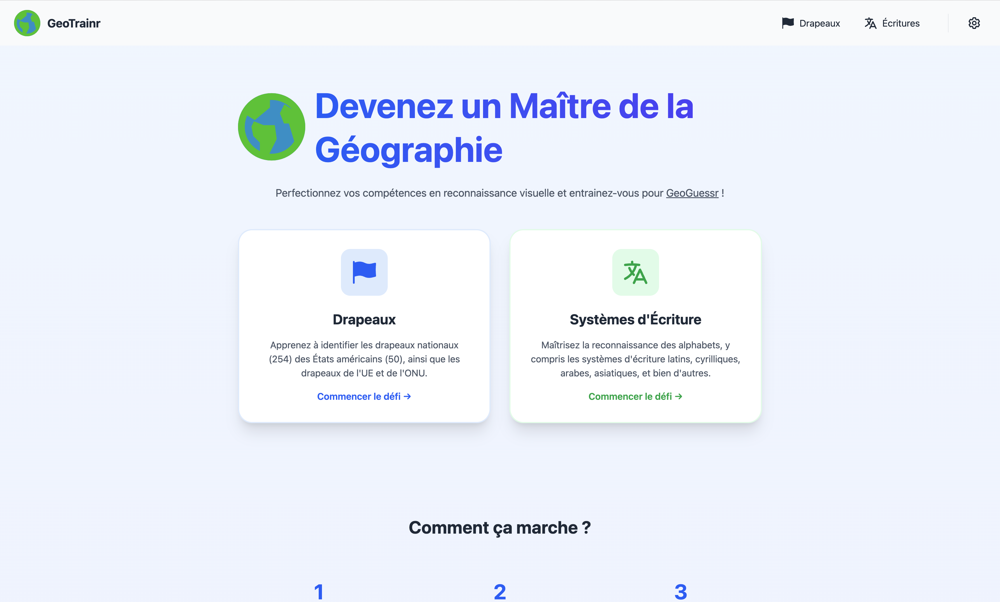
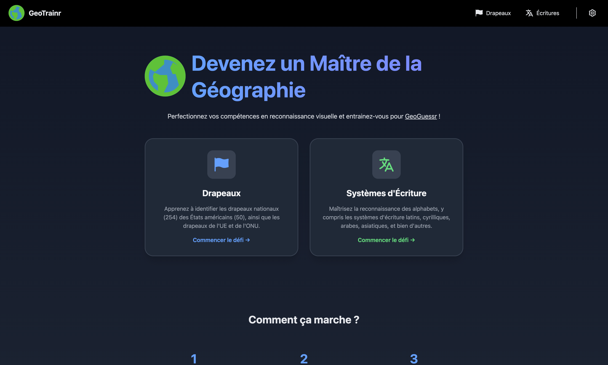
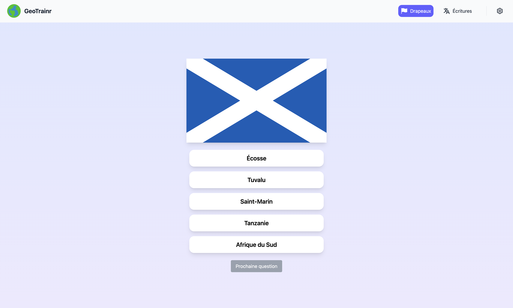
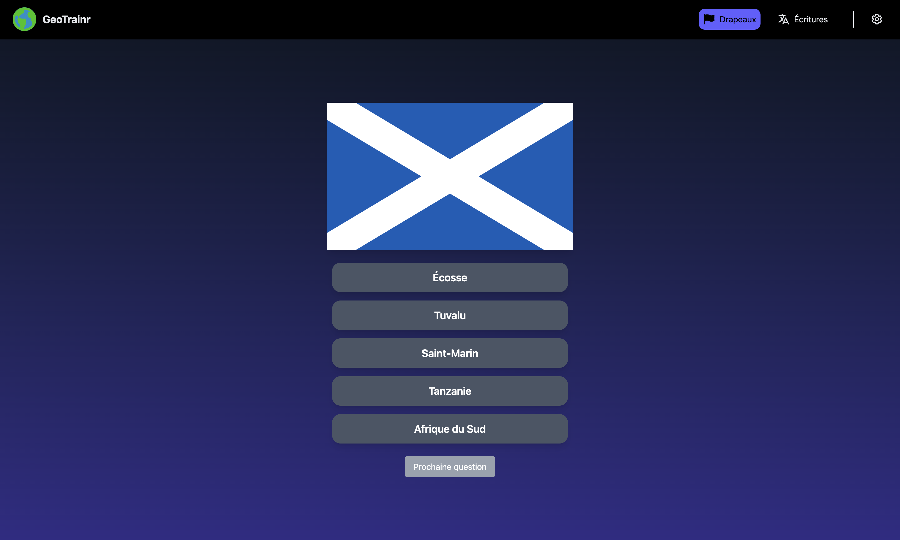
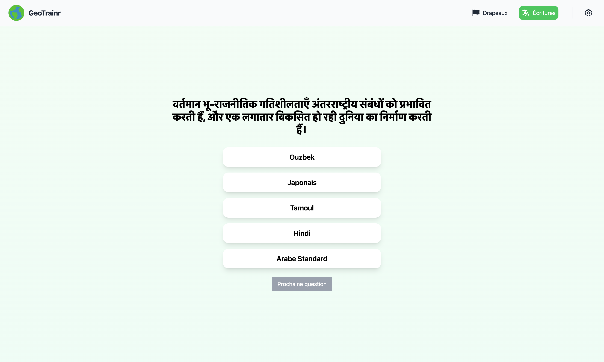
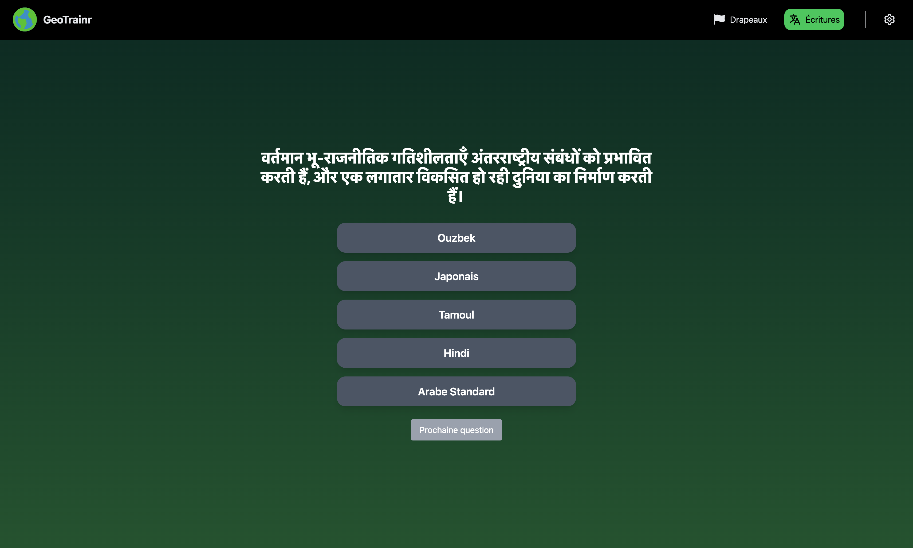
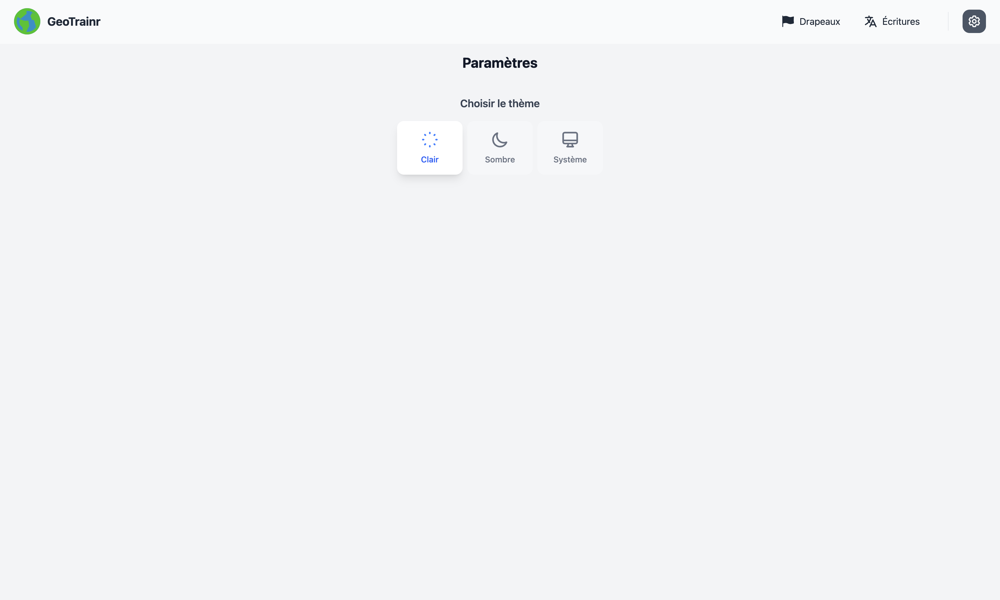
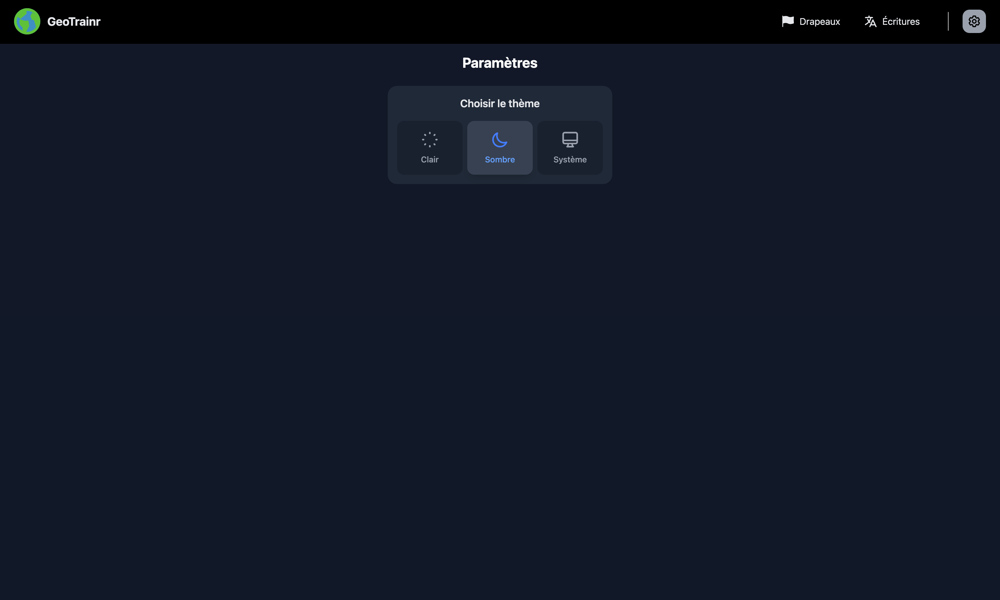

### [`GeoTrainr`](http://localhost:5173/FlagFinder#/)

Perfectionnez vos compétences en reconnaissance visuelle et entraînez-vous pour [GeoGuessr](https://www.geoguessr.com/) !

## Présentation du projet

GeoTrainr est une plateforme interactive d'entraînement pour les amateurs de géographie et les joueurs de GeoGuessr.
Le jeu propose deux modes d'entraînement basés sur la reconnaissance des drapeaux et des langues.

## Fonctionnalités

- 🏳️ **Quiz des Drapeaux** : Testez vos connaissances des drapeaux du monde en identifiant le bon pays parmi plusieurs options.
- 🔠 **Quiz des Langues** : Trouvez la langue d'une phrase affichée, en choisissant parmi des réponses plausibles basées sur des regroupements logiques.
- 🌗 **Mode sombre** : Une interface adaptée aux préférences des utilisateurs.
- 📱 **Responsive** : Interface entièrement adaptée aux mobiles, tablettes et ordinateurs.

## Modes de jeu

### 🏳️ Mode Drapeaux

Dans ce mode, une image de drapeau s'affiche, et vous devez identifier le pays correspondant parmi cinq propositions.

#### 🔹 Génération des questions
- Les drapeaux sont obtenus dynamiquement via l'API [FlagCDN](https://flagcdn.com/).
- Une liste de pays est stockée dans un fichier JSON (`countries.json`).
- Un pays est sélectionné aléatoirement comme bonne réponse.
- Quatre autres pays sont choisis au hasard comme fausses réponses.
- Les cinq options sont mélangées pour garantir l'équité du jeu.

### 🔠 Mode Langues

Dans ce mode, une phrase est affichée, et vous devez identifier la langue dans laquelle elle est écrite.

#### 🔹 Génération des questions
- Les phrases sont stockées dans `languages.json`, un fichier structuré par régions linguistiques.
- Une langue est choisie aléatoirement, et une phrase associée est affichée.
- Les fausses réponses sont sélectionnées parmi les langues du même groupe régional, garantissant que toutes les options semblent plausibles.
- Les cinq choix sont mélangés pour éviter toute répétition prévisible.

## Interface et accessibilité

- Interface moderne et épurée.
- Mode sombre pour une meilleure lisibilité.
- Navigation fluide entre les différents modes.

## 📷 Captures d'écran










## 💻 Installation et utilisation

### Prérequis
- Node.js (version 16 ou supérieure recommandée)
- npm ou yarn

### Installation
```sh
# Cloner le projet
git clone https://github.com/Gautierpicon/FlagFinder.git
cd FlagFinder

# Installer les dépendances
npm install
```

### Démarrer l'application
```sh
npm run dev
```

L'application sera accessible sur `http://localhost:5173/`.

## 🎯 Contribution

Toutes les contributions sont les bienvenues ! Pour contribuer :
1. Clonez le projet 
2. Créez une branche spécifique (`feature-nouvelle-fonctionnalite`) 🛠
3. Faites vos modifications et testez-les ✅
4. Soumettez une pull request 📩

Si vous trouvez un bug ou souhaitez suggérer une amélioration, vous pouvez ouvrir une issue [ici](https://github.com/Gautierpicon/FlagFinder/issues/new).

---

🌍 **Rejoignez-nous et devenez un expert en géographie avec GeoTrainr !** 🚀